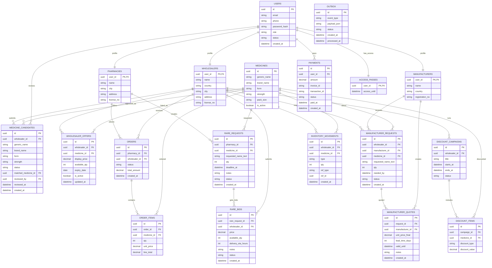

# DEVELOPER GUIDE

## 1) Project Layout
```text
cmd/
  api/           # Fiber HTTP API
  worker/        # Outbox listener + Asynq workers
internal/
  auth/          # JWT + password hashing
  cache/         # Redis client
  config/        # Viper config
  db/            # GORM init + models
  http/          # middleware, response, pagination
  modules/
    users/
    catalog/
    offers/
    inventory/
    orders/
    rare/
    manufacturer/
    discounts/
    payments/
    outbox/
    sse/
  worker/        # worker runtime and processors
migrations/      # golang-migrate SQL
deploy/nginx/    # gateway/rate limiting config
```

## 1.1) Recent Catalog Refactor
- The active runtime model is now offer-centric instead of medicine-centric.
- The primary searchable entity is `wholesaler_offers`.
- Required offer fields:
  - `name`
  - `display_price`
- Optional offer fields:
  - `producer`
  - `expiry_date`
- Search is performed directly against offer `name`.
- Duplicate prevention at catalog level was intentionally removed.
- Each imported row is stored as its own offer with a generated backend `id`.

## 2) Conventions

### Error Format
All API errors follow:
```json
{
  "error": {
    "code": "STRING",
    "message": "STRING",
    "details": {}
  }
}
```

### Logging (zerolog)
Per-request fields:
- `request_id`
- `user_id` (if auth)
- `role` (if auth)
- `path`
- `method`
- `status`
- `latency_ms`

Critical business logs:
- Offer changes
- Inventory movement writes
- Order status transitions
- Payment verify outcomes

### Auth and RBAC
- JWT access token for protected APIs.
- JWT refresh token for renew flow.
- Backend RBAC is authoritative:
  - `PHARMACY`
  - `WHOLESALER`
  - `MANUFACTURER`
  - `ADMIN`

### Pagination
Cursor-based for list endpoints.
- Request: `?limit=20&cursor=<base64(timestamp|id)>`
- Response:
```json
{
  "items": [],
  "next_cursor": "string|null",
  "has_more": true
}
```

### Idempotency
Payment webhook uses `invoice_id` uniqueness and checks already-PAID rows before mutating state.
Webhook signature transport:
- Header: `X-Signature`
- Algorithm: `HMAC-SHA256`
- Signature payload: `invoice_id:transaction_id:STATUS_UPPER`
- Secret: `PAYMENT_WEBHOOK_SECRET` (raw string from env)

### Offer Import Model
- Excel rows are imported as wholesaler offers.
- Required fields:
  - `name`
  - `display_price`
- Optional fields:
  - `producer`
  - `expiry_date`
- The backend does not attempt medicine matching, deduplication, or admin review.

## 3) Core Workflows

### Order + Stock Reservation
1. Pharmacy creates order.
2. API starts DB transaction.
3. Offer rows are locked with `SELECT ... FOR UPDATE`.
4. Available stock is computed from `inventory_movements` by `offer_id`.
5. Reservation movement (`RESERVED`) is inserted.
6. `wholesaler_offers.available_qty` cache field is updated.
7. `orders` + `order_items` persisted.
8. Outbox events written and `NOTIFY outbox_new` sent.

Order response note:
- order list/detail responses include pharmacy profile fields resolved from `pharmacies` + `users`:
  - `PharmacyName`
  - `PharmacyCity`
  - `PharmacyAddress`
  - `PharmacyLicenseNo`
  - `PharmacyEmail`
  - `PharmacyPhone`
- order list responses also include `Items[]` from `order_items` snapshots:
  - `OfferID`
  - `ItemName`
  - `Producer`
  - `Qty`
  - `UnitPrice`
  - `LineTotal`
- wholesaler clients should display these fields when present instead of deriving labels from `PharmacyID`.

Offer contract note:
- `wholesaler_offers.available_qty` is a denormalized cache field populated from `inventory_movements`.
- The public `/offers` API no longer accepts direct stock changes.
- Stock must change only through inventory movement endpoints/services.
- Search is performed by `name`, not by `medicine_id`.

### Payment + Access Pass
1. User creates invoice (`payments.status=PENDING`).
2. Gateway webhook arrives with signature.
3. API verifies signature and invoice.
4. If already `PAID`, ignore mutation (idempotent).
5. Mark payment as `PAID`, upsert/extend `access_passes.access_until`.
6. Emit outbox events: `payment.verified`, `access.updated`.

### Outbox + LISTEN/NOTIFY
1. API writes event to `outbox`.
2. API calls `pg_notify('outbox_new', outbox_id)` in same tx.
3. Worker listens on `outbox_new`.
4. Worker processes row, invalidates cache, publishes SSE packet over Redis pubsub, marks row `PROCESSED`.
5. On failure: mark `FAILED`, enqueue retry task in Asynq.

### SSE
1. Client opens `GET /api/v1/stream/offers`.
2. API subscribes to Redis channel (`sse_offers`) and forwards to in-memory broker.
3. Worker publishes `offer.updated`, `inventory.changed`, and `order.status_changed` events to Redis pubsub from outbox processor.

### Notification Foundation
1. API stores user-level notification preferences in `notification_preferences`.
2. API stores device/browser registrations in `notification_devices`.
3. Worker routes outbox business events into `notifications` inbox rows.
4. Worker writes push delivery attempts into `notification_deliveries`.
5. Push provider is configurable:
   - `noop` for local/dev without provider credentials
   - `fcm` for Android and Web push delivery
6. Invalid/unregistered push tokens are deactivated automatically after provider failure detection.

Notification endpoints:
- `GET /api/v1/notifications`
- `GET /api/v1/notifications/devices`
- `GET /api/v1/notifications/preferences`
- `PUT /api/v1/notifications/preferences`
- `POST /api/v1/notifications/devices`
- `DELETE /api/v1/notifications/devices/:id`
- `POST /api/v1/notifications/:id/read`
- `POST /api/v1/notifications/read-all`

Notification push config:
- `NOTIFICATION_PUSH_PROVIDER=noop|fcm`
- `FCM_CREDENTIALS_FILE=/path/to/service-account.json`
- `FCM_CREDENTIALS_JSON=<raw service account json>`
- `FCM_DRY_RUN=true|false`

### Offer Import
1. Wholesaler app parses an Excel row.
2. Backend can receive:
   - a single offer payload via `POST /api/v1/offers`
   - or many rows via `POST /api/v1/offers/batch`
3. Required fields are validated:
   - `name`
   - `display_price`
4. Optional fields may be stored when present:
   - `producer`
   - `expiry_date`
5. Batch import validates each row independently and returns row-level errors with zero-based indexes.
6. Backend generates a new offer `id` and stores the row without catalog dedupe.
7. Search later works directly on stored offer names.

## 4) Cursor Rules by Domain
- Offers: `ORDER BY updated_at DESC, id DESC` and cursor `(updated_at, id) < (...)`
- Orders: `ORDER BY created_at DESC, id DESC` and cursor `(created_at, id) < (...)`
- Rare Requests: `ORDER BY deadline_at ASC, id ASC` and cursor `(deadline_at, id) > (...)`
- Manufacturer Requests: `ORDER BY created_at DESC, id DESC` and cursor `(created_at, id) < (...)`

## 5) Mermaid ER Diagram



