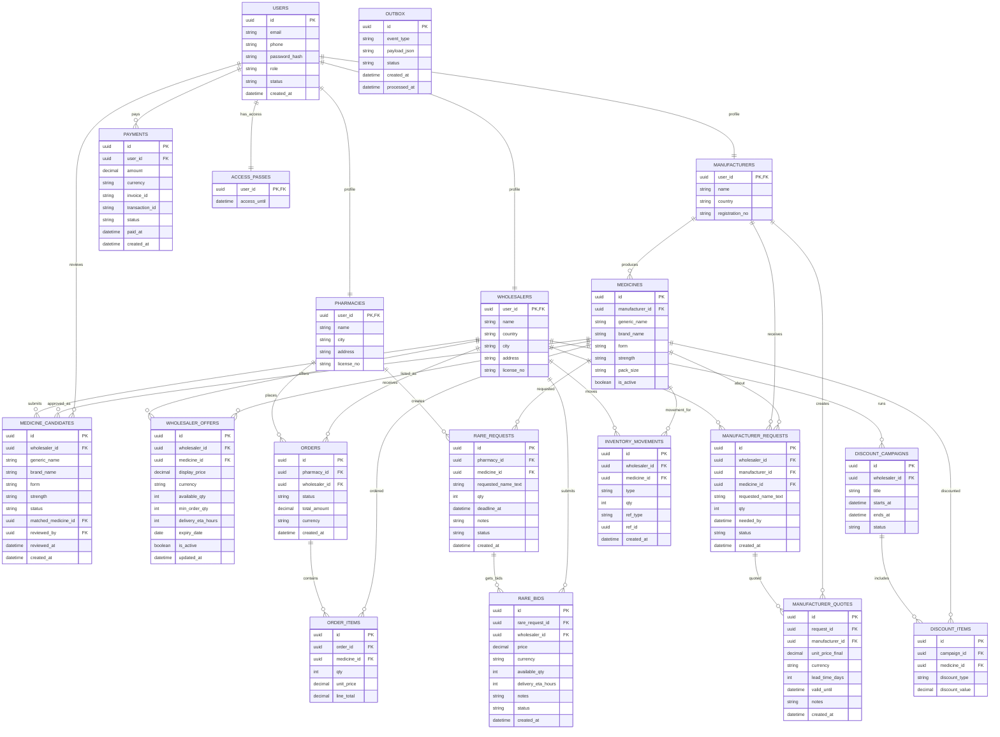

# DEVELOPER GUIDE

## 1) Project Layout
```text
cmd/
  api/           # Fiber HTTP API
  worker/        # Outbox listener + Asynq workers
internal/
  auth/          # JWT + password hashing
  cache/         # Redis client
  config/        # Viper config
  db/            # GORM init + models
  http/          # middleware, response, pagination
  modules/
    users/
    catalog/
    offers/
    inventory/
    orders/
    rare/
    manufacturer/
    discounts/
    payments/
    outbox/
    sse/
  worker/        # worker runtime and processors
migrations/      # golang-migrate SQL
deploy/nginx/    # gateway/rate limiting config
```

## 2) Conventions

### Error Format
All API errors follow:
```json
{
  "error": {
    "code": "STRING",
    "message": "STRING",
    "details": {}
  }
}
```

### Logging (zerolog)
Per-request fields:
- `request_id`
- `user_id` (if auth)
- `role` (if auth)
- `path`
- `method`
- `status`
- `latency_ms`

Critical business logs:
- Offer changes
- Inventory movement writes
- Order status transitions
- Payment verify outcomes

### Auth and RBAC
- JWT access token for protected APIs.
- JWT refresh token for renew flow.
- Backend RBAC is authoritative:
  - `PHARMACY`
  - `WHOLESALER`
  - `MANUFACTURER`
  - `ADMIN`

### Pagination
Cursor-based for list endpoints.
- Request: `?limit=20&cursor=<base64(timestamp|id)>`
- Response:
```json
{
  "items": [],
  "next_cursor": "string|null",
  "has_more": true
}
```

### Idempotency
Payment webhook uses `invoice_id` uniqueness and checks already-PAID rows before mutating state.
Webhook signature transport:
- Header: `X-Signature`
- Algorithm: `HMAC-SHA256`
- Signature payload: `invoice_id:transaction_id:STATUS_UPPER`
- Secret: `PAYMENT_WEBHOOK_SECRET` (raw string from env)

### Catalog Identity + Import Review
- Canonical medicine identity is normalized:
  - `generic_name`
  - `brand_name`
  - `form`
  - `strength`
- Normalization rules:
  - trim outer whitespace
  - lowercase
  - collapse repeated whitespace
  - punctuation/symbols are reduced to spaces
- Backend enforces duplicate prevention on the normalized identity at DB level.
- Wholesaler Excel/app import flow must call validation before creating an offer for a new medicine.
- If a medicine is not matched, the wholesaler submits a `medicine_candidate` instead of creating a catalog medicine directly.
- Candidate review statuses:
  - `PENDING`
  - `APPROVED`
  - `REJECTED`
- Validation response statuses:
  - `MATCHED`
  - `AMBIGUOUS`
  - `SUGGESTED_MATCH`
  - `NEW_MEDICINE`
  - `PENDING_REVIEW`

## 3) Core Workflows

### Order + Stock Reservation
1. Pharmacy creates order.
2. API starts DB transaction.
3. Offer rows are locked with `SELECT ... FOR UPDATE`.
4. Available stock is computed from `inventory_movements`.
5. Reservation movement (`RESERVED`) is inserted.
6. `wholesaler_offers.available_qty` cache field is updated.
7. `orders` + `order_items` persisted.
8. Outbox events written and `NOTIFY outbox_new` sent.

### Payment + Access Pass
1. User creates invoice (`payments.status=PENDING`).
2. Gateway webhook arrives with signature.
3. API verifies signature and invoice.
4. If already `PAID`, ignore mutation (idempotent).
5. Mark payment as `PAID`, upsert/extend `access_passes.access_until`.
6. Emit outbox events: `payment.verified`, `access.updated`.

### Outbox + LISTEN/NOTIFY
1. API writes event to `outbox`.
2. API calls `pg_notify('outbox_new', outbox_id)` in same tx.
3. Worker listens on `outbox_new`.
4. Worker processes row, invalidates cache, publishes SSE packet over Redis pubsub, marks row `PROCESSED`.
5. On failure: mark `FAILED`, enqueue retry task in Asynq.

### SSE
1. Client opens `GET /api/v1/stream/offers`.
2. API subscribes to Redis channel (`sse_offers`) and forwards to in-memory broker.
3. Worker publishes `offer.updated` and `inventory.changed` events to Redis pubsub from outbox processor.

### Medicine Import + Admin Review
1. Wholesaler app parses Excel row and sends it to `POST /api/v1/medicines/validate`.
2. Backend normalizes `generic_name`, `brand_name`, `form`, `strength`.
3. Backend checks:
   - exact normalized match in `medicines`
   - existing pending duplicate in `medicine_candidates`
   - close suggestions using trigram similarity
4. Backend returns one of:
   - `MATCHED`: exact medicine found
   - `SUGGESTED_MATCH`: no exact match, but one strong suggestion exists
   - `AMBIGUOUS`: multiple close candidates exist
   - `NEW_MEDICINE`: no close match found
   - `PENDING_REVIEW`: same new medicine already waits for admin
5. If wholesaler confirms it is new, app sends `POST /api/v1/medicine-candidates`.
6. Backend stores the row in `medicine_candidates` with status `PENDING`.
7. Admin reviews candidate:
   - approve by linking to an existing medicine
   - approve by creating a new medicine
   - reject with note
8. Only after approval does the candidate become linked to a real `medicines.id`.

Catalog import API surface:
- `POST /api/v1/medicines/validate`
- `POST /api/v1/medicine-candidates`
- `GET /api/v1/admin/medicine-candidates`
- `POST /api/v1/admin/medicine-candidates/:id/approve`
- `POST /api/v1/admin/medicine-candidates/:id/reject`

## 4) Cursor Rules by Domain
- Offers: `ORDER BY updated_at DESC, id DESC` and cursor `(updated_at, id) < (...)`
- Orders: `ORDER BY created_at DESC, id DESC` and cursor `(created_at, id) < (...)`
- Rare Requests: `ORDER BY deadline_at ASC, id ASC` and cursor `(deadline_at, id) > (...)`
- Manufacturer Requests: `ORDER BY created_at DESC, id DESC` and cursor `(created_at, id) < (...)`

## 5) Mermaid ER Diagram

